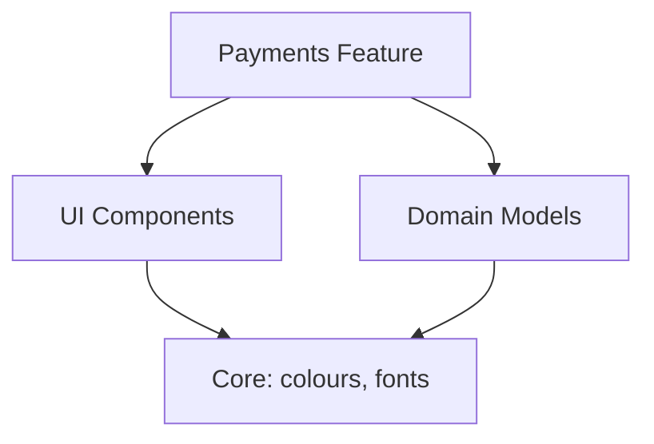
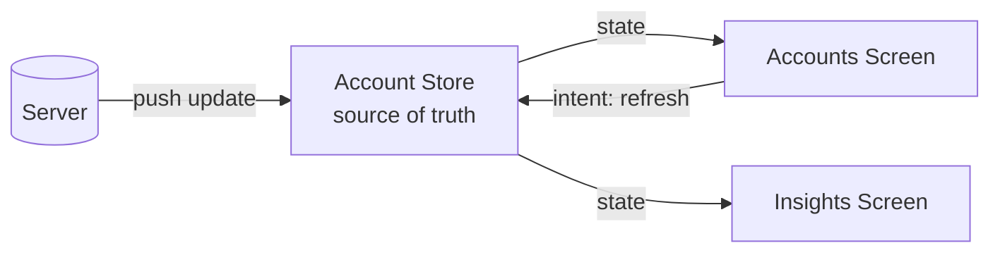
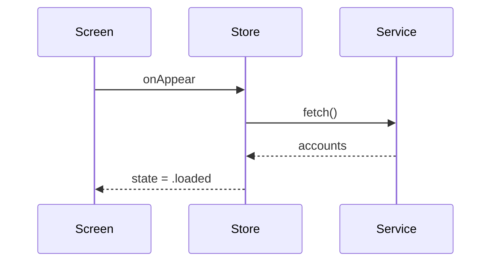
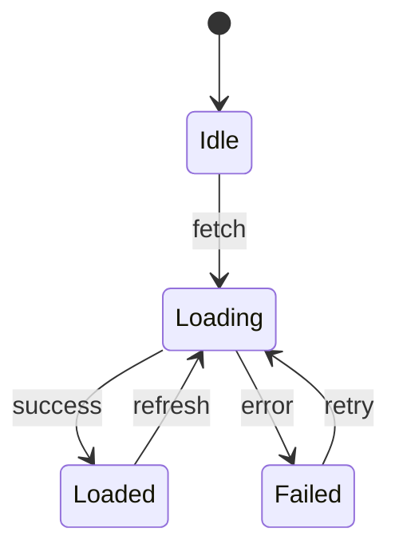
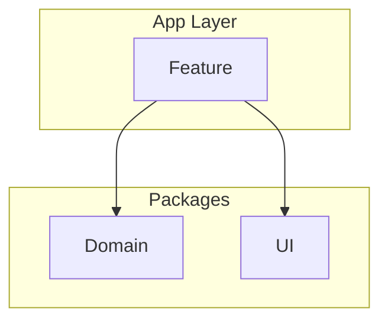

# Mermaid Primer — the 4 diagrams that cover ~90% of system design

You've never used Mermaid. It's ~30 min to learn and it's a portable senior skill —
GitHub, GitLab, most design-doc tools render it natively. The point isn't the syntax;
it's that **text-based diagrams keep you in the logic (who depends on whom, what happens
in what order) instead of pixel-pushing.** Think in these; polish in draw.io only for talks.

View them: paste into https://mermaid.live, or preview in most IDEs/GitHub.

## 1. Dependency graph — "who is allowed to know about whom"

The Track A workhorse. Arrows point in the direction of the dependency (A → B means
"A depends on B, A breaks if B changes"). Good architecture keeps arrows pointing toward
stable, abstract things.

Ask of every arrow: _should this dependency exist? Is it pointing toward the more stable
thing?_ A cycle (A → B → A) is almost always a design smell.

## 2. Data-flow diagram — "how does state move and who owns it"

The Track B workhorse. Shows sources of truth, who mutates, who observes.

Ask: _where is the single source of truth? Who is allowed to mutate it? Who only reads?_

## 3. Sequence diagram — "what happens, in what order, over time"

Best for interactions and race conditions. Vertical = time.

Ask: _what if two of these overlap? What's in flight when the user taps again?_

## 4. State diagram — "what states can this thing be in, and how does it move"

Kills whole classes of bugs (the "impossible state" ones — think a single `Loadable<T>`
enum vs a pile of booleans).

Ask: _can I represent an illegal state? If yes, redesign so I can't._

## Syntax cheatsheet

- `graph TD` top-down, `graph LR` left-right.
- Node shapes: `[box]`, `(rounded)`, `([stadium])`, `[(database)]`, `{diamond decision}`.
- Arrows: `-->` solid, `-.->` dotted, `-->|label|` labelled.
- ` ` for line breaks inside a node.
- Subgraphs group nodes into a module/boundary:

That's enough to model almost anything. Reach for draw.io only when an audience needs polish.
